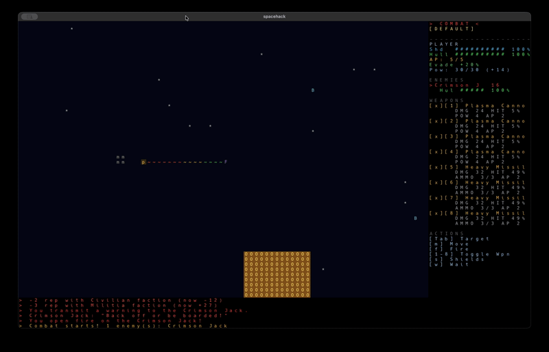
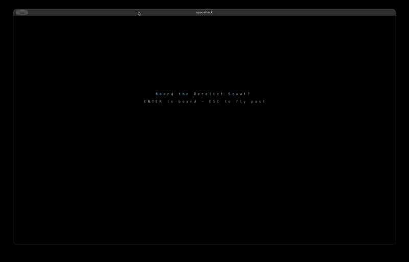

# spacehack

```
####### #######  #####   #####  ####### ##   ##  #####   #####  ##   ##
##      ##   ## ##   ## ##   ## ##      ##   ## ##   ## ##   ## ##  ##
####### ####### ####### ##      #####   ####### ####### ##      #####
     ## ##   ## ##   ## ##   ## ##      ##   ## ##   ## ##   ## ##  ##
####### ##   ## ##   ##  #####  ####### ##   ## ##   ##  #####  ##   ##
```

**A traditional ASCII-art sci-fi roguelike.** The year is 2200. Humankind has spread
across more than a dozen star systems linked by jump gates of unknown origin —
and you're a freelance pilot trying to make a living on the frontier.

Trade, smuggle, hunt bounties, and upgrade your ship across 13 star systems.
Death is permanent.

## Gameplay

<a href="docs/space_combat.gif"></a>
<a href="docs/boarding_ground_combat.gif"></a>

*Space combat (left) and boarding a derelict scout for ground combat (right).*

## Disclaimer

This project has been an experiment/resarch project of mine to learn/explore
using 100% free AI tools to design and build a playable game.

- I know python enough to follow the code generally, but I accepted that the AI
  will generate code that I do not understand fully.
- I modifed very little code, but I reviewed code and forced coding architecture
  where I thought it mattered.
- I modified through AI design docs which you can see in the repo. Then had the
  AI execute the design docs in phases.
- AI slop is most present in the stroy/plot/lore text. I'm enjoying this process
  enough that I do plan on replacing 99% of that AI slop output.
- Cloning the repo and using freebuff or your favorite free AI codign platform
  should allow any new features/modifications to your personal desires with ease
- I run freebuff in a docker jail to help protect it from accessing anything
  outside of the repo.

## Docker jail for freebuff

1. build the docker cache image
2. make a function in your rc file (example is from my .zshrc)
3. call `freejail`

```
docker run -it --name freebuff_builder node:18-slim sh -c "apt-get update && apt-get install -y git python3 python3-venv python3-pip && npm install -g freebuff"
docker commit freebuff_builder freejail-cached:latest

freejail () {
	docker run -it -v ~/code/spacehack:/workspace -w /workspace freejail-cached:latest sh -c "apt-get update && apt-get install -y git python3 python3-venv python3-pip && npm install -g freebuff && python3 -m venv --copies .docker_venv && . ./.docker_venv/bin/activate && pip install -e . && freebuff"
}
```

Then you can just call `freejail` to launch the editor.

## Features

- **A living universe** — 13 star systems connected by jump gates, each with
  its own planets, stations, economy, and dangers
- **Choose your legend** — pick a species (Human, Martian) and class
  (Pirate, Merchant, Bounty Hunter) that shape your starting skills and credits
- **Walk the cities** — guild halls, bars, spaceports, and terminals in every
  port town; talk to NPCs, take missions, refuel, repair, and rearm
- **Space combat** — turn-based dogfights with lasers, plasma cannons, and
  missiles (ammo is scarce and persistent — buy more at the mechanic)
- **Ground combat** — board derelict wrecks and explore planets on foot,
  with personal weapons, armor, and fog of war
- **Missions for every temperament** — deliveries, bounties, smuggling runs,
  salvage operations, and shady bar work. Boards refill each month
- **Dynamic trade** — buy low on producer worlds, sell high where it's
  consumed. Prices shift with supply and demand
- **Factions & reputation** — your standing with four factions gates pay,
  prices, and who's willing to trade with you
- **Deep progression** — earn XP, spend skill points on ship or ground
  skills, and unlock traits as you level
- **Permadeath** — one ship, one life. The frontier doesn't forgive

## Get the game

### Prebuilt (recommended)

Grab the latest release for your platform from the
**[Releases](https://github.com/rmhadley/spacehack/releases)** page:

- **macOS** — `spacehack-macos.zip` (a `.app` bundle)
- **Windows** — `spacehack-windows.zip` (a standalone `.exe`)

> The builds are ad-hoc signed (no paid Developer ID, no notarization), so
> Gatekeeper blocks downloaded copies. On macOS 14 and earlier, right-click
> → **Open** works as a one-time bypass. **macOS 15+ (Sequoia) removed that
> bypass**, so the free options there are the terminal one-liner below or
> running from source. Real "double-click and it opens" requires Apple
> notarization (a paid Developer ID).
>
> Terminal one-liner (clears the quarantine attributes, then launches):
>
>     xattr -cr /path/to/spacehack.app && open /path/to/spacehack.app
>
> (`-cr` clears both `com.apple.quarantine` and, on macOS 13+,
> `com.apple.provenance`.) Source installs (below) carry no quarantine at
> all and need none of this.
>
> If the app instead says **"damaged and can't be opened"** (and even
> "Open Anyway" does nothing), the signature was lost in transit — the
> release zip is built with `ditto` to preserve it, so re-download the
> latest release; older zips made with plain `zip` are not fixable except
> by `xattr -cr`. The only way to eliminate the "unidentified developer"
> prompt entirely is Apple notarization, which requires a Developer ID
> certificate.

### From source

Requires **Python 3.10+**. macOS / Linux:

```bash
 git clone https://github.com/rmhadley/spacehack.git

cd spacehack
python3 -m venv .venv
source .venv/bin/activate
pip install -e .
python -m spacehack
```

Windows (from the repo folder):

```bat
py -m venv .venv
.venv\Scripts\activate
pip install -e .
run_spacehack.bat
```

Linux/macOS can also just run `./run_spacehack` after `pip install -e .`.

## How to play

### The basics

1. **Create a character** — pick a species, then a class. Your choices set
   your starting skills, reputation, and credits.
2. **Explore the city** — move with the **arrow keys**, the **vim keys**
   (`h j k l` cardinals, `y u b n` diagonals), or the **numpad**. Walk
   into buildings and NPCs to interact.
3. **Find work** — the guild halls and the bar have mission boards
   (deliveries, bounties, smuggling, salvage). You can hold up to 5 missions.
4. **Launch** — walk into your ship at the spaceport, then fly the system.
   Bump into planets to land, or jump gates to travel between systems.
5. **Survive** — combat is turn-based. Manage your AP, power, shields, and
   ammo. When AP hits 0, the enemy takes their turn.

### Controls

| Key | Action |
|-----|--------|
| `Arrows` / `h j k l` / `numpad` | Move (cardinals / diagonals) |
| `G` | Auto-navigate to a selected target (space) |
| `M` | Navigation map (space) |
| `T` | Comms panel — hail nearby ships (space) |
| `I` | Cargo hold |
| `C` | Character screen (level, skills, traits) |
| `F` | Faction standings |
| `Q` | Quest log |
| `?` | **In-game guide** — full documentation, always available |
| `.` | Wait one turn |
| `ESC` | Quit / back |

**Combat:** `TAB` cycles targets · `F` fires all active weapons · `1-9`
toggles weapons on/off · `S` cycles shield regen · `W` waits. Move with
arrows, vim keys, or numpad.

**Tip:** press `?` in-game for a complete guide covering combat math, trade
formulas, missions, and more.

## Credits

- Built on [python-tcod](https://github.com/HexDecimal/python-tcod) with a
  [pygame](https://www.pygame.org/) presentation layer
- Typeface: [DejaVu Sans Mono](https://dejavu-fonts.github.io/) (bundled) —
  the in-game CP437 tilesheet is DejaVu-derived

## License

Released under the [MIT License](LICENSE) — Copyright (c) 2026 rmhadley.
See the `LICENSE` file for the full text.
