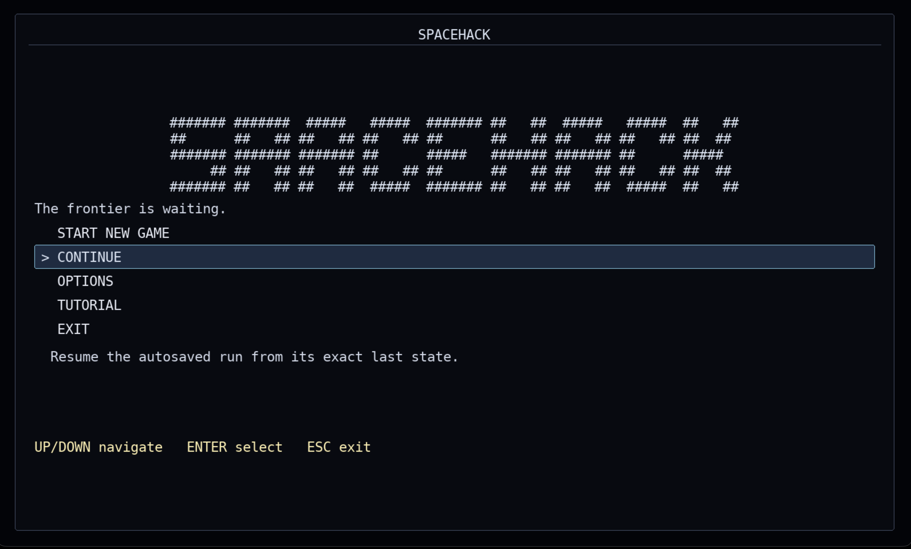
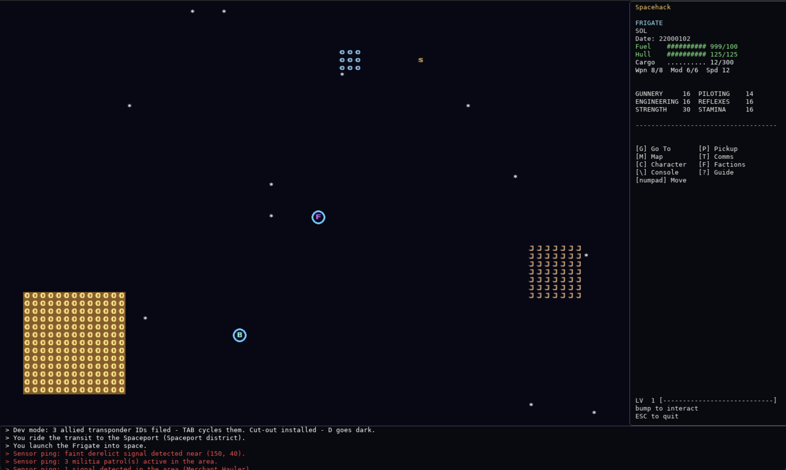
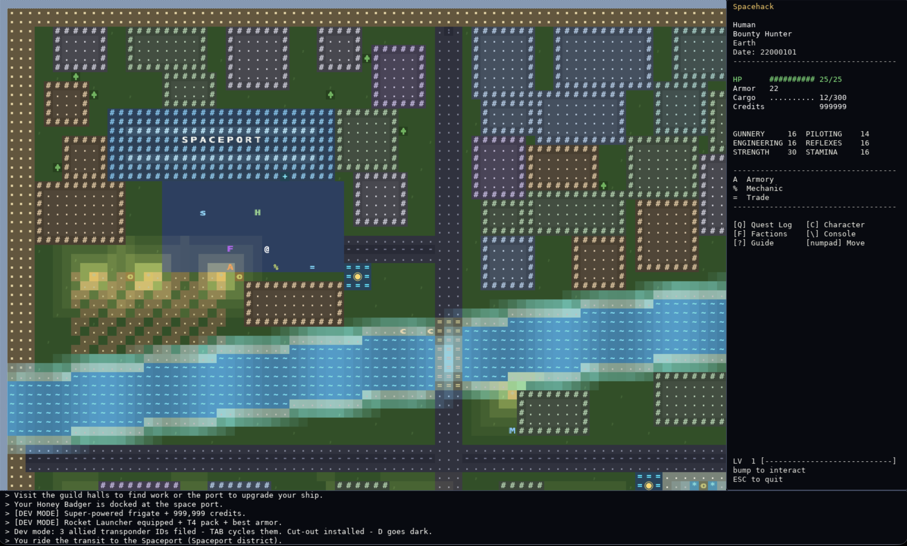

# spacehack

```
####### #######  #####   #####  ####### ##   ##  #####   #####  ##   ##
##      ##   ## ##   ## ##   ## ##      ##   ## ##   ## ##   ## ##  ##
####### ####### ####### ##      #####   ####### ####### ##      #####
     ## ##   ## ##   ## ##   ## ##      ##   ## ##   ## ##   ## ##  ##
####### ##   ## ##   ##  #####  ####### ##   ## ##   ##  #####  ##   ##
```

<p align="center">
  
</p>

**An ASCII-art inspired sci-fi roguelike.** 

The year is 2200. Humankind has spread across many star systems, linked by jump gates. You are a freelance pilot making a living on the frontier: trading, bounty hunting, and surviving.

Trade, smuggle, hunt bounties, and upgrade your ship.

Death is permanent.

## Features

- **A living universe**: many star systems connected by jump gates, each with
  its own planets, stations, economy, and dangers
- **Space combat**: turn-based dogfights with lasers, plasma cannons, and
  missiles
- **Ground combat**: board derelict wrecks and explore planets on foot,
  with personal weapons, armor, and fog of war
- **Missions for every temperament**: deliveries, bounties, smuggling runs,
  salvage operations, and shady bar work.
- **Dynamic trade**: buy low on producer worlds, sell high where it's
  consumed. Prices shift with supply and demand
- **Factions & reputation**: your standing with four factions gates pay,
  prices, behavior and more.
- **Deep progression**: earn XP, spend skill points on ship or ground
  skills, and unlock traits as you level
- **Permadeath**: one ship, one life.

## Screenshots

<p align="center">
  
  
  
  
</p>

## Get the game

### Prebuilt (recommended)

Grab the latest release for your platform from the
**[Releases](https://github.com/rmhadley/spacehack/releases)** page:

- **macOS** — `spacehack-macos.zip` (a `.app` bundle)
- **Windows** — `spacehack-windows.zip` (a standalone `.exe`)

> The builds are ad-hoc signed (no paid Developer ID, no notarization), so
> Gatekeeper blocks downloaded copies. On macOS 14 and earlier, right-click
> → **Open** works as a one-time bypass. **macOS 15+ (Sequoia) removed that
> bypass**, so the free options there are the terminal one-liner below or
> running from source. Real "double-click and it opens" requires Apple
> notarization (a paid Developer ID).
>
> Terminal one-liner (clears the quarantine attributes, then launches):
>
>     xattr -cr /path/to/spacehack.app && open /path/to/spacehack.app
>
> (`-cr` clears both `com.apple.quarantine` and, on macOS 13+,
> `com.apple.provenance`.) Source installs (below) carry no quarantine at
> all and need none of this.

### From source

Requires **Python 3.10+**. The runtime uses the Pygame-compatible Community Edition package (`pygame-ce`), which provides prebuilt wheels for macOS ARM and current CPython releases.

MacOS / Linux:

```bash
 git clone https://github.com/rmhadley/spacehack.git

cd spacehack
python3 -m venv .venv
source .venv/bin/activate
pip install -e .
python -m spacehack
```

Windows (from the repo folder):

```bat
py -m venv .venv
.venv\Scripts\activate
pip install -e .
run_spacehack.bat
```

Linux/macOS can also just run `./run_spacehack` after `pip install -e .`.

## How to play

### The basics

1. **Create a character** — pick a species, then a class. Your choices set
   your starting skills, reputation, and credits.
2. **Explore the city** — Earth is larger than the viewport, so keep walking
   to scroll through its districts. Move with the **arrow keys**, the **vim keys**
   (`h j k l` cardinals, `y u b n` diagonals), or the **numpad**. Walk
   into buildings and NPCs to interact.
3. **Find work** — the guild halls and the bar have mission boards
   (deliveries, bounties, smuggling, salvage). You can hold up to 5 missions.
4. **Launch** — walk into your ship at the spaceport, then fly the system.
   Bump into planets to land, or jump gates to travel between systems.
5. **Survive** — combat is turn-based. Manage your AP, power, shields, and
   ammo. When AP hits 0, the enemy takes their turn.

### Controls

| Key | Action |
|-----|--------|
| `Arrows` / `h j k l` / `numpad` | Move (cardinals / diagonals) |
| `G` | Auto-navigate to a selected target (space) |
| `M` | Navigation map (space) |
| `T` | Comms panel — hail nearby ships (space) |
| `I` | Cargo hold |
| `C` | Character screen (level, skills, traits) |
| `F` | Faction standings |
| `Q` | Quest log |
| `?` | **In-game guide** — full documentation, always available |
| `.` | Wait one turn |
| `ESC` | Quit / back |

**Combat:** `TAB` cycles targets · `F` fires all active weapons · `1-9`
toggles weapons on/off · `S` cycles shield regen · `W` waits. Move with
arrows, vim keys, or numpad.

**Tip:** press `?` in-game for a complete guide covering combat math, trade
formulas, missions, and more.

## Credits

- Built on [pygame-ce](https://pyga.me/) (the Pygame-compatible Community Edition) with a project-owned
  framebuffer, input layer, and CP437 glyph atlas
- Typeface: [DejaVu Sans Mono](https://dejavu-fonts.github.io/) (bundled) —
  the in-game CP437 tilesheet is DejaVu-derived

## License

Released under the [MIT License](LICENSE) — Copyright (c) 2026 rmhadley.
See the `LICENSE` file for the full text.
